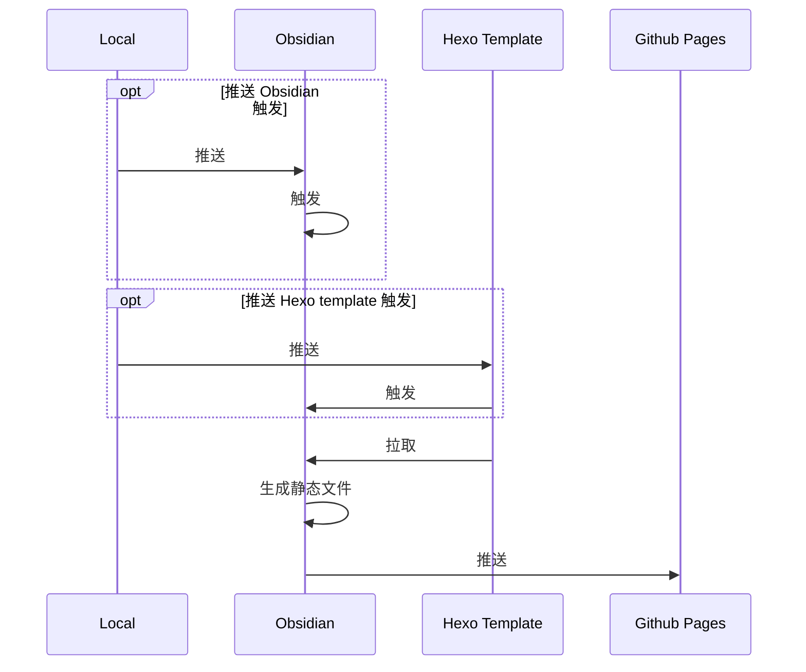

	click Obsidian "https://github.com/7zMonkey/Obsidian"
click Hexo "https://github.com/7zMonkey/obsidian2hexo-template"
click Github "https://github.com/7zMonkey/7zMonkey.github.io"
subgraph 触发方式1
Local--推送-->Obsidian
end
subgraph obsidian actions
Obsidian<--拉取-->Hexo
Obsidian==推送==>Github
end
subgraph 触发方式2
Local--推送-->Hexo
end
subgraph hexo actions
Hexo-.-触发-.->Obsidian
end