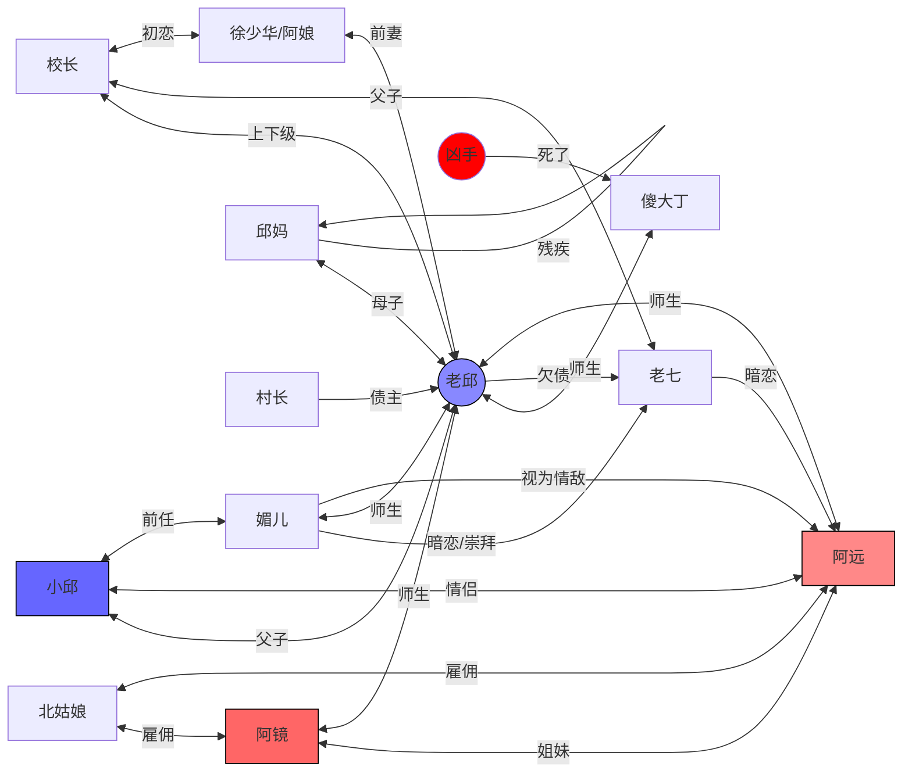
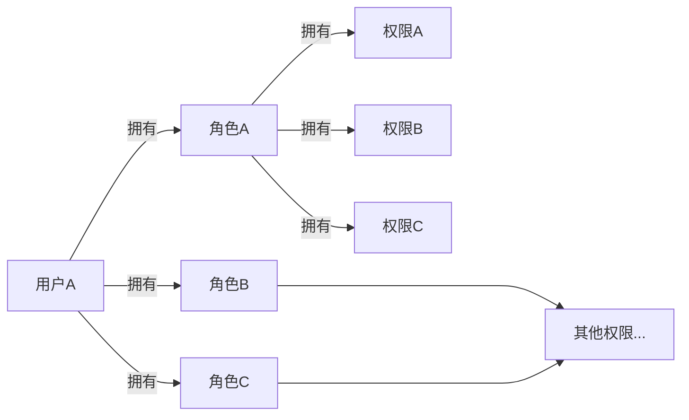

```mermaid
graph LR
style A fill:#6666FF, stroke:#000000
style B fill:#8888FF, stroke:#000000
style C fill:#FF6666, stroke:#000000
style D fill:#FF8888, stroke:#000000
style ? fill:#FF0000
A[小邱]
B((老邱))
C[阿镜]
D[阿远]
E[老七]
F[媚儿]
G[校长]
H[徐少华/阿娘]
I[邱妈]
J[北姑娘]
K[村长]
M[傻大丁]
?((凶手))
B <--师生-->M
? --死了--> M
A<--父子-->B
C<--姐妹-->D
A<--情侣-->D
A<--前任-->F
D<--师生-->B
C<--师生-->B
E--暗恋-->D
K--债主-->B
B--欠债-->E
F--暗恋/崇拜 -->E
F<--师生-->B
F--视为情敌-->D
G<--上下级-->B
G<--父子-->E
G<--初恋-->H
H<--前妻-->B
I<--母子-->B
I--残疾-->I
J<--雇佣-->C
J<--雇佣-->D
```
老邱死了, 就在昨晚,自杀了.

```mermaid
graph LR

A[用户A] --拥有--> B[角色A]
A --拥有--> C[角色B]
A --拥有--> D[角色C]
B --拥有--> E[权限A]
B --拥有--> F[权限B]
B --拥有--> G[权限C]
C ----> 其他权限...
D ----> 其他权限...
```

测试修改文件自动上传？！？？？？
委托Obsidian Git 上传文件

为什么不上传！！
6
